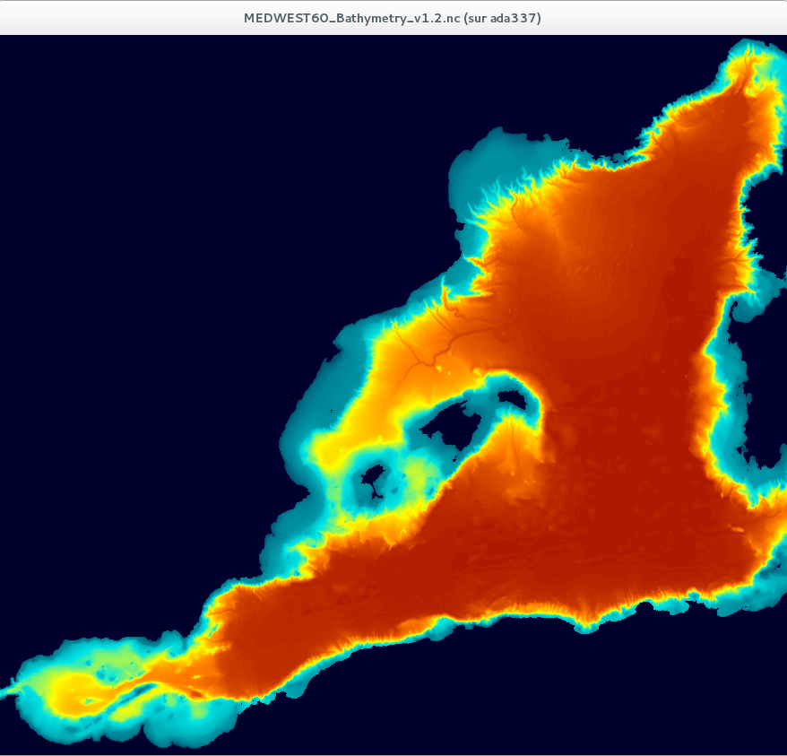

# Making MEDWEST60 configuration

## Installing the NEMO code for this configuration
  This config share the same code as the eNATL60 experiment performed within [PRACE Resumption](https://ocean-next.fr/expertise/natl60/) project achieved at BSC on `marenostrum4` super computer, by Laurent Brodeau.  
  It is based on :
   * NEMO release 3-6 @rev 10404
   * XIOS 2.0  @ rev 1630
   * DCM at NEMODRAK/release-3.6 

### Good practices when using DCM (and other goodies ... )
   * assume svn repositories are in `$WORKDIR/DEV` aka `$DEVDIR`
   * assume git repositories are in `$WORKDIR/DEVGIT` aka `$DEVGIT`

### Installing DCM:
   You need to have an access to `ige-meom-cal1.u-ga.fr`.  This action is to be done only once.

```
    cd $DEVGIT
    git clone ssh://<USER>@ige-meom-cal1.u-ga.fr/mnt/SSD/molines/GITSERVER/NEMODRAK_release-3.6.git
```
  See how to set up DCM in your environnement in the `dcm_getting_started.md` document in `NEMODRAK_release-3.6/DOC/`.

### Installing XIOS:
   This is also to be done once, and for that we just checkout the *ad-hoc* revision of XIOS, and follow the instruction to compile the code and libraries.  
  1. Checkout the code:  

    ```
    cd $DEVDIR
    svn co  http://forge.ipsl.jussieu.fr/ioserver/svn/XIOS/branchs/xios-2.0 -r 1630   xios-2.0_rev_1630
    ```

  1. Compile XIOS

    ```
    cd xios-2.0_rev_1630
    ./make_xios --job 6 --arch X64_ADA
    ```

    At this stage, if the previous `make_xios` was successful, you end up with an operational XIOS in `$DEVDIR/xios-2.0_rev_1630`


### Create your MEDWEST60 configuration
   With DCM, the creation of a new configuration (*e.g* `MEDWEST60-GSL01`) is a few-steps procedure:
  1. Create the directories used for your config.    
     `dcm_mkconfdir_remote MEDWEST60-GSL01`  
     > Note that at IDRIS, the storage area is on a different machine (`ergon`) that the production machine (`ada`). This is why we use `dcm_mkconfdir_remote` instead of `dcm_mkconfdir_local`.
  1. Edit the basic `makefile` for importing eNATL60 code.   
     `cd $UDIR/CONFIG_MEDWEST60/MEDWEST60-GSL01`  
     You need to edit the `makefile` for some points:

     ````
     ...
     PREV_CONFIG = $(HOMEDCM)/CONFIGS/eNATL60.L300-BLBT02

     ...
     ```

     `make copyconfigall`  
     This last instruction will import eNATL60  code and CPP keys in your configuration directory. 
  1. Edit the CPP.keys (imported from eNATL60) and remove `key_lim3` (no ice model).   
  1. Customize the architecture file:  
   `dcm_lsarch.ksh` will list all available architecture files in NEMO and DCM.  
   `cp .../arch-X64_ADAuser.fcm ARCH/arch-X64_ADAsl.fcm`  
   edit this file to fit with your XIOS library location:  

   ```
   %XIOS_HOME           $DEVDIR/xios-2.0_rev_1630
   ```

  1. Edit makefile again:  
    
     ```
     ...
     MACHINE = X64_ADAsl
     # NCOMPIL_PROC : number of procs to use for the compilation of the code.
     NCOMPIL_PROC = 6   # up to you !
     ...
     OPA = 'use'
     LIM2 = 'notused'
     LIM3 = 'notused'
     ...
     SVN = 'nocheck'
     GIT = 'check'
     ...
     ```

  1. Install the code and compile:   

     ```
     make install && make
     ```


     
     
---------------------------
---------------------------
---------------------------
---------------------------


## History of MEDWEST60 preparation:
   All configuration files will be kept on `ige-meom-cal1.u-ga.fr` in `/mnt/meom/MODEL_SET/MEDWEST60/MEDWEST60-I/`  
   All configuration files will (hopefully) have a version number, in order to identify them unambiguously.  
   A `README.md` file will briefly describe the files and their version.    
### Geographical domain: Bathymetry and coordinates.
   * Domain : We extract the MEDWEST60 domain from eNATL60 domain using the following ncks command (extension of 2 points to the east (v3) compared to v1)

   ```
       ncks -4 -L 1 -d x,5529,6411 -d y,1869,2671 eNATL60_coordinates_v3.nc4 MEDWEST60_coordinates_v3.nc4
   ```

     We end up with a  horizontal domain of `883 x 803` grid points.  
     

   * Bathymetry v3 is obtained with the following :
```ncks -4 -L 1 -d x,5529,6411 -d y,1869,2671  eNATL60_BATHY_GEBCO_2014_2D_msk_v3_merg.nc4 MEDWEST60_Bathymetry_v3.nc```
   
   * Then the following modifications are applied to the bathymetry: 
        * v3.1: Fill in Gulf of Gascogne with zeros
        `cdfbathy -file MEDWEST60_Bathymetry_v3.nc4 -zoom -zoom 1 243 655 803 -raz_zone`
        * v3.2 Fill in small bay on the west coast of Cap Corse with zeros
        `cdfbathy -file MEDWEST60_Bathymetry_v3.1.nc4 -zoom 883 883 671 673 -raz_zone`
        * v3.3: Fill in small bay on the south west coast of corsica with zeros
        `cdfbathy -file MEDWEST60_Bathymetry_v3.2.nc4 -zoom 878 883 550 556 -raz_zone`
        * v3.4: Ceil bathymetry to 2890 m (level 197 in the eNATL60 config)
        `cdfbathy -file MEDWEST60_Bathymetry_v3.3.nc4 -set_above 2890`   
        


### Vertical grid:
  `eNATL60` uses a 300 level grid. In the `MEDWEST60` configuration we aim at using only 150 vertical levels.
#### *Issues:*   
  1. Level 150 is only 1830 m deep.

     ```
     ...
     z(149) t(1) gdept_0(149)=1809.34 
     z(150) t(1) gdept_0(150)=1830.41 
     z(151) t(1) gdept_0(151)=1851.55 
     ...
     ```

  1. The bathymetry can be ceiled to 2890m (level 197) --> `v3.4`

     ```
     z(195) t(1) gdept_0(195)=2842.78 
     z(196) t(1) gdept_0(196)=2866.5 
     z(197) t(1) gdept_0(197)=2890.26 
     z(198) t(1) gdept_0(198)=2914.07 
     z(199) t(1) gdept_0(199)=2937.92 
     z(200) t(1) gdept_0(200)=2961.82 
     z(201) t(1) gdept_0(201)=2985.77 
     z(202) t(1) gdept_0(202)=3009.77 
     z(203) t(1) gdept_0(203)=3033.81 
     z(204) t(1) gdept_0(204)=3057.9
     ```

     In `v1.2` 6825 grid points were modified (set to 2890). This is less than 1% of the grid points.

#### *Decision:* 
  Choice is to be made among the following:
  1. Use 198 vertical level (remember that last level is masked). 
  1. Redefine a 150 level grid with maximum depth of 3200 m (actual maximum in bathy `v3.3`)
  
  --> __Choise is made to use 198 levels (first option after bathymetry has been ceiled to 2890m).__

### Domain decomposition
   *  This configuration is developped for running a small ensemble (10 to 20 members) at IDRIS center, on the `ada` machine (where the biggest class allows for 2048 cores).  
      Using `MPP_PREP` tool, we obtain possible  domain decomposition, first for a single member affording 2000 or 1000 cores, and then for a 10 members run (each member on 200 cores) or 20 members run (each member on 100 cores).

 
   ```
     jpni  jpnj   jpi   jpj  jpi x jpj  proc  elim   sup
     -----------------------------------------------------
      51    84    20    12        240  2000  2284  0.67850
     121    34    10    26        260  2000  2114  0.73504

      16   126    57     9        513  1000  1016  0.72515
      41    50    24    19        456  1000  1050  0.64457
     
      10    37    90    24       2160   200   170  0.61065
      26    14    36    60       2160   200   164  0.61065
     
       9    20   100    43       4300   100    80  0.60782
      27     6    35   136       4760   100    62  0.67285
   ```

### Initial conditions
   * This point is to be discussed : Starting from TS fields from eNATL60 seems OK but :
      * At which date ?
      * With which level of smoothing (hourly average, daily average, monthly average ?)
      * Still a cold start with U and V set to 0. ?
      * Using a restart extraction ??
    --> Firat choice is to use a restart extraction.

### Open Boundaries
   * Likely eNATL60 hourly data for T S U V and SSH.
     * Western BDY is located at the Gibraltar Strait, the Eastern BDT across Corsica and Sardegna.  
     * extract the mesh_mask for the boundaries (with a rim of 10 ?) and use Sosie3 for building the boundaries from eNATL60 files.  
   * Tides at the boundaries comes from the eNATL60 SSH and velocities (no harmonic constituents at the boundaries, but tidal potential ON).
   * See [this report](Making-of-BDY.md) for details of the construction of the BDY Data set.

### Forcing and Runoff:
   * eNATL60 was forced by DFS5.2 fields (EraInterim grid).
   * ERA5 fields may be of interest as they offer hourly atmosphere on a 1/4 deg grid.
   * Runoff : no reasons to take something different that eNATL60.

## First run 
### Prepare namelist

### Setup `includefile.ksh`

### Discuss XIOS issues
  * setting the xml files

## Preparing the Ensemble code:

The ensemble code requires modifications in the following Fortran files:
   * lib\_mpp.F90 : definition of the MPI communicators for each member and each subdomain
   * nemogcm.F90 : modified call to parallelization, multiple XIOS context, multiple ocean.output
   * domain.F90 : multiple name of the experiment (to include member index)
   * stopar.F90 : multiple seed of the random generator, multiple restart filenames
   * diaobs.F90 : multiple names for the files with model equivalent to observations
   * stpctl.F90 : multiple names for the files 'time.step' and 'solver.stat'
   * step.F90 : always call to stochastic routines in ensemble experiments
   * dom\_oce.F90 : integer and character string defining member index

All modfications to the code can easily be traced by searching the string "ensemble" in the code.

To use the modified code in DCM:
   * get the files that need to be modified in compilation directory:
     ```bash
     getfile lib_mpp.F90
     getfile nemogcm.F90
     getfile domain.F90
     getfile stopar.F90
     getfile diaobs.F90
     getfile stpctl.F90
     getfile step.F90
     getfile dom_oce.F90
     ```
   * replace them by their modified version (from the src directory in this repository)
   * recompile the code by:
     ```bash
     make
     ```
